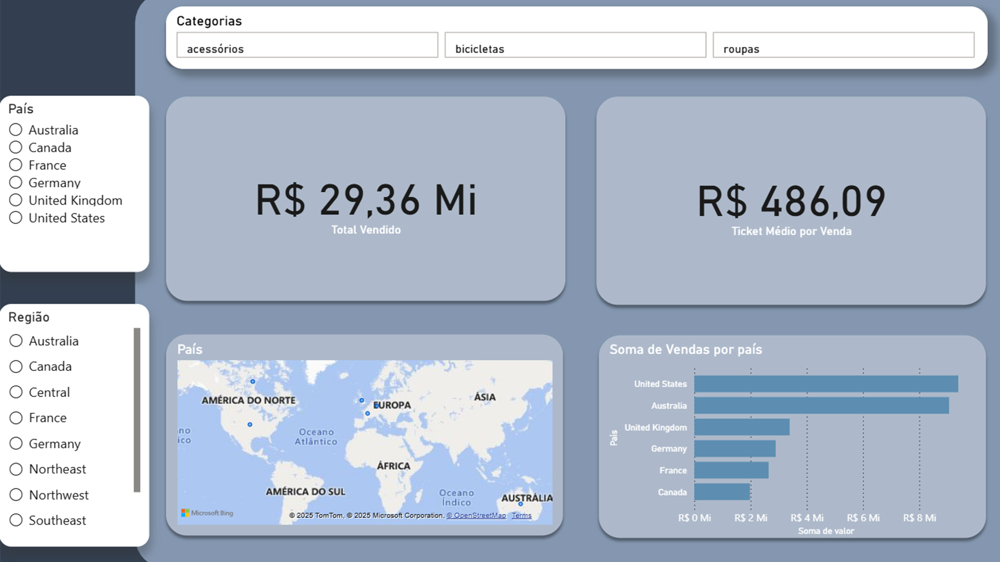
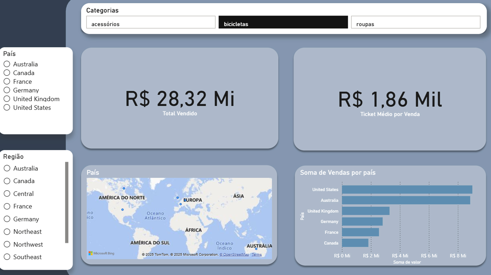
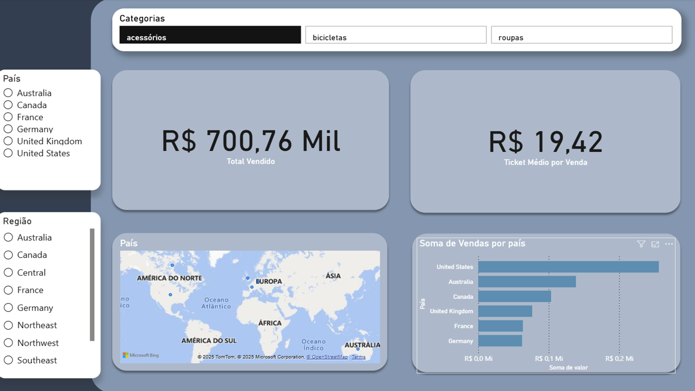
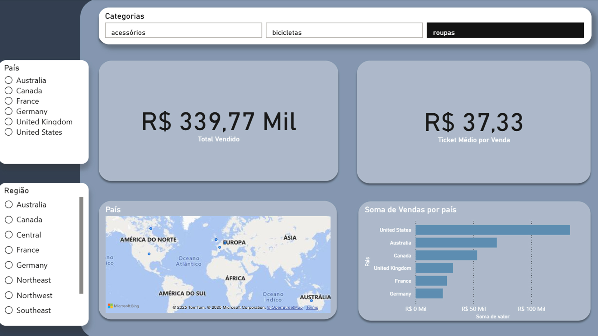

# adventureworks-analise-vendas
Análise de vendas da AdventureWorks utilizando SQL Server e Power BI com foco em risco estratégico e concentração de receita.

## Contexto
A AdventureWorks vem ampliando sua operação e portfólio, mas há indícios de que o desempenho comercial não evolui de forma equilibrada entre canais, regiões e categorias. A diretoria precisa garantir que as decisões recentes não estejam gerando distorções estruturais no negócio.

## Objetivo
Comprovar se a rentabilidade do negócio está sustentada por um conjunto restrito de áreas comerciais, indicando risco estratégico caso haja mudança no comportamento de mercado.

## Fonte dos Dados (Data Source)
- Dataset: AdventureWorksDW2019  
- Provedor: Microsoft  
- Tipo: Data Warehouse Relacional (SQL Server)  
- Finalidade: Projeto educacional e portfólio  
- Origem oficial: https://learn.microsoft.com/en-us/sql/samples/adventureworks-install-configure

> Observação: Este projeto utiliza um dataset público de exemplo fornecido pela Microsoft, destinado exclusivamente a fins educacionais e de portfólio.

## Metodologia de análise
- Utilização do dataset AdventureWorksDW2019, baseado em um modelo de Data Warehouse
- Exploração inicial dos dados no SQL Server para entendimento das tabelas
- Relacionamento entre vendas, produtos, categorias e regiões por meio de INNER JOINs
- Criação de uma base consolidada com informações de produto, categoria e território
- Validação dos principais números do negócio no SQL, como total vendido e ticket médio
- Integração dos dados ao Power BI para construção de dashboards interativos
- Análise de vendas por categoria, país e região, apoiando a identificação de padrões e riscos estratégicos

## Insights
- A Austrália apresenta o maior ticket médio por venda, com valor aproximado de R$ 678,98, indicando vendas unitárias de maior valor quando comparada aos demais países.
- A categoria Acessórios possui o menor ticket médio por venda, em torno de R$ 19,42, caracterizando um alto volume de vendas de baixo valor unitário.
- Austrália e Estados Unidos concentram os maiores volumes de vendas em todas as categorias, destacando-se como os principais mercados da operação.
- O total vendido nos mercados da Austrália e Estados Unidos soma aproximadamente R$ 18,44 milhões, representando cerca de 63% do total de vendas, que é de R$ 29,36 milhões, evidenciando alta dependência de ambos os mercados.
- A categoria Bikes é responsável por aproximadamente 96,46% do total vendido, totalizando cerca de R$ 28,32 milhões, evidenciando forte dependência dessa categoria para a sustentação da receita, oferecendo risco aos ganhos da organização caso houvesse instabilidade no mercado.

## Dashboards

### Visão Geral de Vendas

### Vendas por Categoria – Bikes

### Vendas por Categoria – Acessórios

### Vendas por Categoria – Roupas

## Conclusão
A análise evidencia que os ganhos da AdventureWorks estão fortemente concentrados em poucos mercados, com uma única categoria predominante na geração de receita. Austrália e Estados Unidos respondem por aproximadamente 63% do total das vendas, enquanto a categoria Bikes representa mais de 96% da receita total. Esse cenário expõe a empresa a riscos estratégicos, pois a volatilidade do mercado pode impactar diretamente seus resultados. Dessa forma, torna-se necessária a diversificação geográfica e a redistribuição dos esforços comerciais, visando o fortalecimento das vendas em outras regiões e categorias.

## Tecnologias Utilizadas
- SQL Server
- Power BI
- GitHub
- Dataset AdventureWorks (Microsoft)

